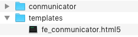
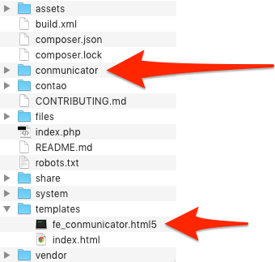

# Installation des Conmunicator
Um den <.CONMUNICATOR> zu installieren, müssen Sie diesen von http://www.conmunicator.de herunterladen. Auf der Startseite finden Sie den Link für den Download der aktuellen Version.

Nach dem Download befindet Sie die ZIP-Datei in Ihrem Download-Ordner. Nach dem Entpacken des Archivs liegt die nachstehende Dateistruktur im gleichnamigen Ordner vor.

Den Ordner Conmunicator kopieren Sie in das Wurzelverzeichniss Ihrer Contao-Installation. Die Datei "fe_conmunicator.html5" legen Sie in dem Unterverzeichnis /templates ab.

Der <.CONMUNICATOR> ist nun lokal einsatzbereit. Für den Betrieb auf einer Top-Level Domain, benötigen Sie eine entsprechende [Lizenz](lizenzen.md).