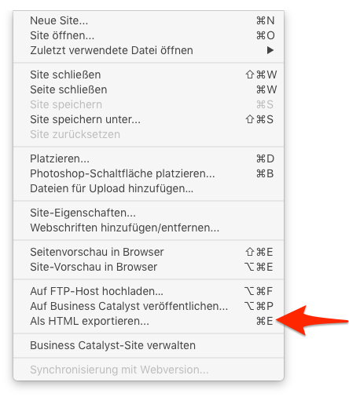
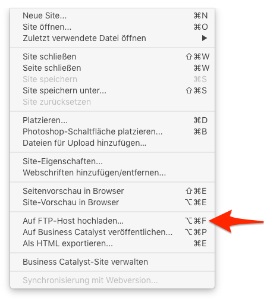
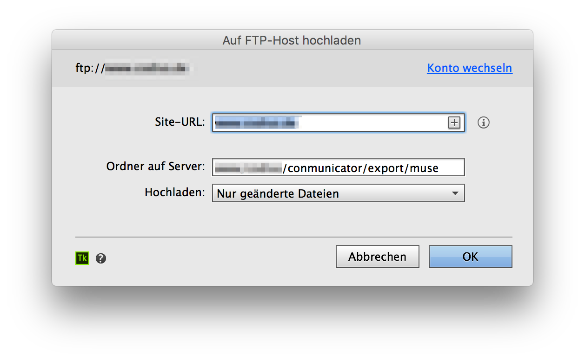
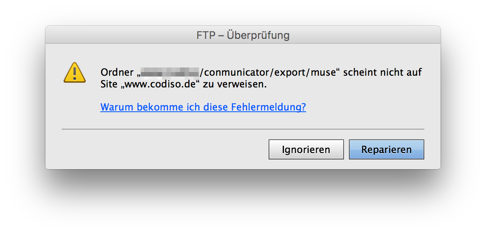

# Export der Adobe MUSE Daten
Um einen Export zu der Contao-Installation durchzuführen, kann man zwei Wege einschlagen. Der erste führt über den HTML-Export, der zweite ist über den FTP-Export machbar.

Unter dem Verzeichnis '/conmunicator/export' existiert ein Ordner 'muse'. Auf diesen Ordner ist das Template "fe_conmunicator.html5" voreingestellt. Sollten Sie einen anderen Namen oder Pfad nutzen wollen, so können Sie dies im Template entsprechend anpassen.

```php
<?php
//==================================================================================
// fe_conmunicator.html5
//----------------------------------------------------------------------------------
// Bringing two worlds together …
//==================================================================================
session_start();

$muse = array(
	"dir"   => "conmunicator/export/muse/",
    [...]
);

include("conmunicator/core/conmunicator.php");
?>
```

## HTML-Export
Den HTML-Export kann man unter dem Menu "Datei" auswählen. Hat man einen Ordner für den Export gewählt, kann der Exportvorgang gestartet werden. Adobe MUSE generiert alle benötigten Dateien und legt diese geordnet in dem gewählten Ordner ab.



Um diese Daten in den Export-Ordner des <.CONMUNICATOR> zu kopieren, ist ein FTP-Transfer notwendig. Nutzen Sie hierzu Ihr bevorzugtes FTP-Programm.

Bei der Nutzung des <.CONMUNICATOR> lokal mit XAMPP oder MAMP, ist der HTML-Export der einfachste Weg, das Projekt in den entsprechenden Ordner der lokalen Contao-Installation zu speichern.

## FTP-Export
Eleganter als der HTML-Export ist der Weg über den eingebauten FTP-Export von Adobe MUSE. In diesem Fall übernimmt Adobe MUSE die Rolle des FTP-Programms. Führt man weitere Veränderungen am Design-Projekt durch, so kopiert Adobe MUSE – bei erneuten Exporten – nur noch die geänderten Daten. Dies beschleunigt den Exportvorgang erheblich.



Geben Sie Ihre FTP-Zugangsdaten Ihres Providers ein und bestätigen Sie die Eingabe. Danach erscheint der nachstehende Dialog.



Tragen Sie eine gültige Domain ein und den Pfad auf den Export-Ordner unter "/conmunicator/export/muse" Ihrer Contao-Installation. Die Einstellung "Nur geänderte Daten" ist korrekt und kann übernommen werden. Bestätigen Sie die Eingabe und Sie werden in der Regel mit der nachstehenden Meldung konfrontiert.



Adobe MUSE erkennt, dass der angegebene Pfad nicht auf das Wurzelverzeichnis der Domain verweist. Klicken Sie auf "Ignorieren" oder betätigen Sie die Esc-Taste und der Upload wird gestartet. Nach einem erfolgreichen Upload wird die eingestellte Domain im Browser aufgerufen. Die gestalterischen Änderungen werden nun direkt angezeigt.
