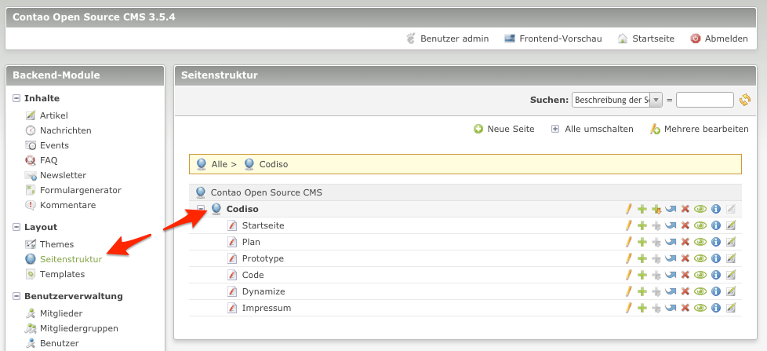
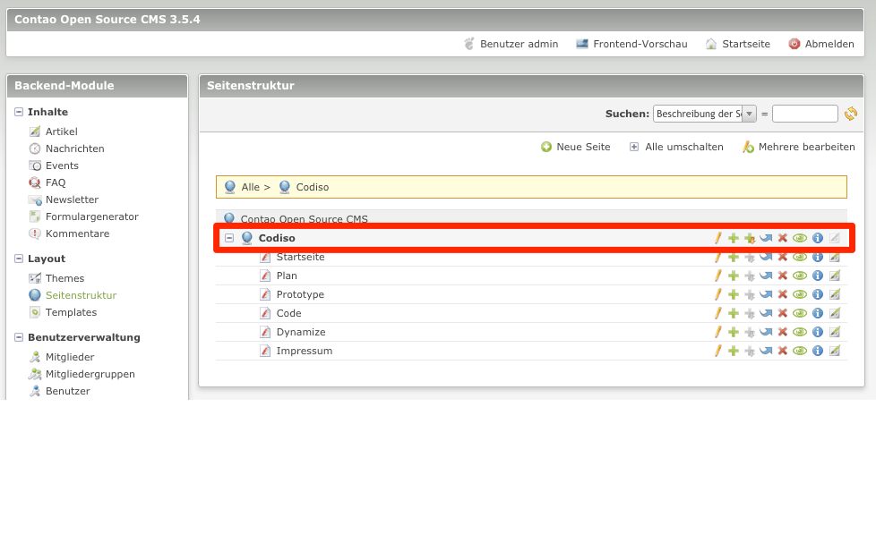

# Die Seitenstruktur von Contao

Um mit dem Contao-CMS Websites ausgeben zu können, benötigt man entsprechende Eintragungen in der Seitenstruktur. Von hier aus steuern Sie gegebenenfalls mehrere Websites mit den entsprechenden Inhaltsseiten. Die Seitenstruktur dient als virtuelle Ordnungsstruktur, in der die einzelnen Inhaltsseiten zueinander in Bezug gebracht werden.

## Startpunkt

Um eine Struktur zu beginnen, benötigt man einen Startpunkt. Von hier aus organisiert sich dann die komplette Site.

### Einstellung des Startpunktes

Startpunkte werden durch blaue Weltkugeln mit einem Kabelanschluss dargestellt. Klicken Sie auf den Stift um einen bestehenden Startpunkt zu konfigurieren.

In den DNS-Einstellungen geben Sie die Sprache für den Startpunkt an. Gegebenenfalls setzen Sie auch die Auswahl "Sprachen-Fallback".

Dem Startpunkt wird das entsprechende Seitenlayout zugewiesen. Dadurch bekommen alle Seiten unter diesem Startpunkt automatisch das gleiche Seitenlayout vererbt. Anderweitige Zuweisungen an speziellen Seiten können, wenn notwendig, zu einem späteren Zeitpunkt erfolgen.

Der Startpunkt ist damit konfiguriert und es können Inhaltsseiten angelegt werden.

## Inhaltsseiten

In Contao werden Inhaltsseiten als "Reguläre Seiten" bezeichnet. Damit nun eine Inhaltsseite mit einer entsprechenden Adobe Muse CC Seite korrespondiert, muss im Seitenalias die passende Bezeichnung eingetragen werden.

Da die Startseite bei einem Adobe Muse CC Export immer "index.html" benannt wird, trägt man im Seitenalias "index" ein.

| Seitenalias: | Bedeutung: |
| -- | -- |
| [alias] | Über den Seitenalias wird die Contao-Seite mit der Adobe Muse CC Seite "\[alias\].html" in Verbindung gesetzt.\|

