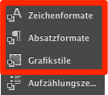

# Dynamisierung des Adobe Muse CC Projektes

Conmunicator nutzt Stile in Adobe Muse CC, um die dynamischen Inhalte aus Contao mit den visuellen Elementen aus Adobe Muse CC zu verbinden. Dies ist ein einfach zu durchzuführender Vorgang und bedarf keiner weiteren Programmierkenntnisse.

Diese Vorgehensweise kann auch von Grafikern durchgeführt werden, die keinerlei Kenntnisse über HTML, CSS oder JavaScript besitzen. So kann eine sehr enge Zusammenarbeit zwischen Grafik und Programmierung erfolgen. Beide beteiligten Parteien besitzen so eine klar definierte Schnittstelle.

Elemente die mit entsprechenden Stilen in Adobe Muse CC versehen sind, werden automatisch durch Inhalte aus Contao ersetzt. Hierzu müssen die Stile der vorgegebenen Syntax entsprechen.

## Stiltypen

Zur einfachen Einbindung von Contao-Inhalten, werden die nachstehenden Stile zur Verfügung gestellt:

| Stil: | Bedeutung: |
| --- | --- |
| cmu\_main | Inhalte der Contao-Hauptspalte. |
| cmu\_header | Inhalte der Contao-Kopfspalte. |
| cmu\_footer | Inhalte der Contao-Fußspalte. |
| cmu\_left | Inhalte der linken Contao-Inhaltsspalte. |
| cmu\_right | Inhalte der rechten Contao-Inhaltsspalte. |
| cmu\_section\_NAME | Inhalte eines eigenen Contao-Layoutbereiches. |
| cmu\_template\_NAME | Inhalt eines eigenen [Code-Templates](templating.md) für ein Device unter Nutzung der Benamung. Die entsprechenden Dateien werden unter dem Pfad **\/conmunicator\/templates\/****\[****DEVICE\]** abgelegt. Existiert ein benanntes [Code-Template](templating.md) noch nicht, wird dies automatisch als Datei erzeugt und der Inhalt des Tamplates wird aus dem HTML-Code entnommen. |
| cmu\_article\_LANG\_ID | Inhalt eines speziellen Contao-Artikels für eine bestimmte Sprache unter Nutzung der Artikel-ID. |
| cmu\_content\_LANG\_ID | Inhalt eines speziellen Contao-Inhaltselementes für eine bestimmte Sprache unter Nutzung der Element-ID. |
| cmu\_module\_LANG\_ID | Inhalt eines speziellen Contao-Moduls für eine bestimmte Sprache unter Nutzung der Modul-ID. |

Ersetzen Sie die nachstehenden Platzhalter durch passende Werte:

| Platzhalter: | Ersetzung: |
| --- | --- |
| DEVICE | kann die Werte "desktop","tablet" oder "phone" annehmen. |
| NAME | ersetzen durch den gewünschten Bezeichner |
| LANG | ersetzen durch die gewünschte Sprache \(de,en,it,etc.\) |
| ID | ersetzen durch die gewünschte ID des jeweiligen Elementes |

Die Stile können im Bereich der Adobe Muse CC Stile genutzt werden. Hier werden Schriftstile, Absatzstile und Grafikstile zur Verfügung gestellt. In der Regel sind die Grafikstile der richtige Wahl, für die Platzierung der Conmunicator Stile.

Stile können auch mehrfachdefinitionen enthalten. Für mehr Informationen siehe das Kapitel [Mehrsprachigkeit](cmu_multilanguage.md).

## Platzhalter

Platzhalter können in Texten genutzt werden. Sie werden durch die unten beschriebenen Inhalte ersetzt. Die Schreibweise ist an die der [Contao-InsertTags](https://docs.contao.org/books/manual/3.5/de/04-inhalte-verwalten/inserttags.html) angelehnt. InsertTags können auch auch in Adobe Muse CC genutzt werden.

| Platzhalter: | Bedeutung: |
| --- | --- |
| { {cmu_main} } | Wird durch die Inhalte der Contao-Hauptspalte ersetzt. |
| {{cmu\_header\} \} | Wird durch die Inhalte der Contao-Kopfspalte ersetzt. |
| \{ \{cmu\_footer\} \} | Wird durch die Inhalte der Contao-Fußspalte ersetzt. |
| \{ \{cmu\_left\} \} | Wird durch die Inhalte der linken Contao-Inhaltsspalte ersetzt. |
| \{ \{cmu\_right\} \} | Wird durch die Inhalte der rechten Contao-Inhaltsspalte ersetzt. |
| \{ \{cmu\_section\_NAME\} \} | Inhalte eines eigenen Contao-Layoutbereiches. |
| \{ \{cmu\_template\_NAME\} \} | Inhalt eines eigenen [Code-Templates](templating.md) für ein Device unter Nutzung der Benamung. Die entsprechenden Dateien müssen unter dem Pfad **\/conmunicator\/templates\/****\[****DEVICE\]** abgelegt sein. |
| \{ \{cmu\_article\_LANG\_ID\} \} | Wird durch den Inhalt eines speziellen Contao-Artikels für eine bestimmte Sprache unter Nutzung der Artikel-ID ersetzt. |
| \{ \{cmu\_content\_LANG\_ID\} \} | Wird durch den Inhalt eines speziellen Contao-Inhaltselementes für eine bestimmte Sprache unter Nutzung der Element-ID ersetzt. |
| \{ \{cmu\_module\_LANG\_ID\} \} | Wird durch den Inhalt eines speziellen Contao-Moduls für eine bestimmte Sprache unter Nutzung der Modul-ID ersetzt. |
| \{ \{cmu\_version\} \} | Wird durch die aktuelle Version des Conmunicator ersetzt. |
| \{ \{cmu\_muversion\} \} | Wird durch die aktuelle Adobe Muse CC Version ersetzt. |
| \{\{cmu\_phpversion\} \} | Wird durch die aktuelle PHP Version ersetzt. |
| \{ \{cmu\_language\} \} | Wird durch die aktuelle Sprache ersetzt. Kann bei Bedarf auch in Links genutzt werden. |

Ersetzen Sie die nachstehenden Platzhalter durch passende Werte:

| Platzhalter: | Ersetzung: |
| --- | --- |
| NAME | ersetzen durch den gewünschten Bezeichner |
| LANG | ersetzen durch die gewünschte Sprache \(de,en,it,etc.\) |
| ID | ersetzen durch die gewünschte ID des jeweiligen Elementes |

