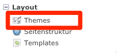
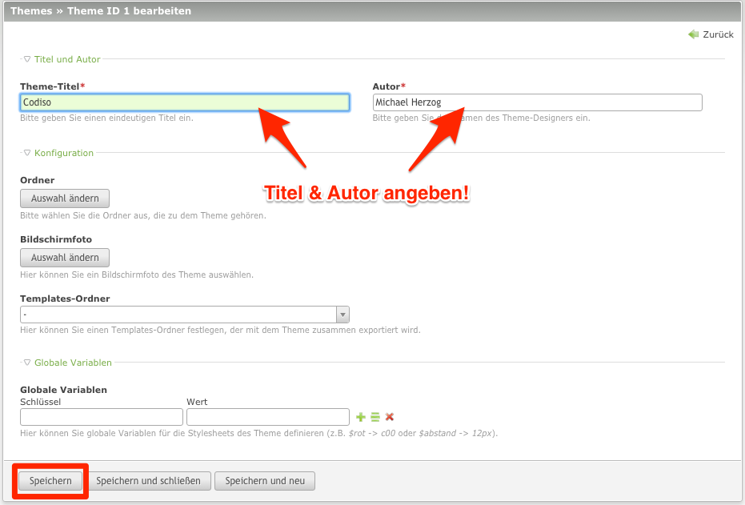
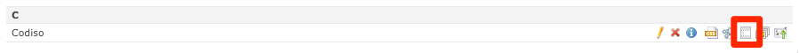
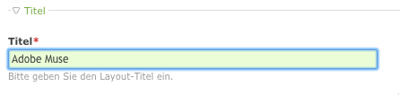
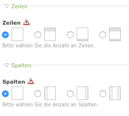
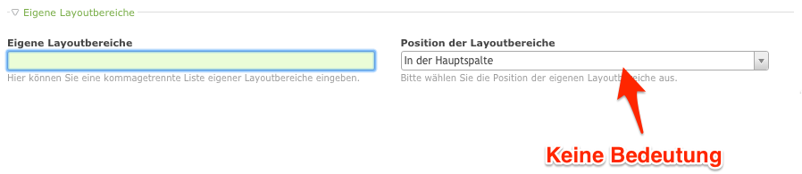
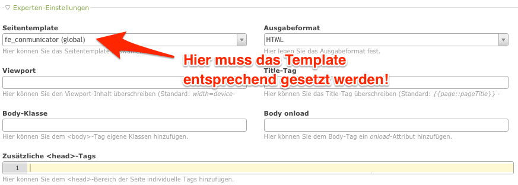

# Erstellen eines Conmunicator-Themes

Themes übernehmen im Contao-CMS die Aufgabe ein Design an eine Site zu binden. In einem Theme gibt es Seitenlayouts, die die Inhaltsbereiche definieren. In diesen können dann entsprechende redaktionelle Inhalte angezeigt werden. Um das Theme mit &lt;.CONMUNICATOR&gt; zu nutzen, müssen hier die passende Einstellungen gemacht werden.

## Anlegen eines Themes

Da in einer neuen Contao-Installation keine Themes enthalten sind, muss mindestens eines von Ihnen angelegt werden. Wechseln Sie hierzu in den Bereich Themes in der Modulspalte.

In der noch leeren Liste nutzen Sie die Schaltfläche "neues Theme".

Es folgt der Eingabedialog in dem Sie alle notwendigen Einstellungen für dieses Theme festlegen können. Vergeben Sie einen Titel und den zugehörigen Autor. Danach speichern Sie die Einstellungen.

## Anlegen eines Seitenlayouts

Damit Contao Informationen darüber erhält, wie eine Inhaltsseite später dargestellt werden muss, erstellen Sie nun ein Seitenlayout. Mit einem Click auf das entsprechende Icon gelangen Sie zu der noch leeren Liste der Seitenlayouts.

In der List wählen Sie die Schaltfläche "neues Layout". Im Eingabedialog stellen Sie alle notwendigen Punkte ein.

### Titel

Vergeben Sie einen sinnvollen Bezeichner für Ihr Layout. Dieser Eintrag ist ein rein organisatorischer Vorgang innerhalb von Contao.

### Zeilen

Mit Contao kann das klassische Fünf-Spalten-Raster vorkonfiguriert werden. In verbindung mit Adobe Muse CC können Sie diese Spalten nutzen, auch wenn diese nicht nach dem klassischen Raster angeordnet werden sollten. Jede Spalte die Sie anwählen steht ihnen dann zur Befüllung von Inhalten in einem Adobe Muse CC Layout zur Verfügung.

### Eigene Layoutbereiche

In diesem Bereich können Sie weitere Layoutbereiche definieren, die in Ihrer Seite eine Rolle spielen. Diese werden durch Komma getrennt eingegeben und stehen dann auch zur Befüllung von Inhalten bereit. Über einen passenden Stil in Adobe Muse CC können Sie bestimmen wo diese Inhalte in Ihrer Adobe Muse CC Seite angezeigt werden sollen.

Eine Positionierung der Layoutbereiche in Contao haben keine Bedeutung, da deren Positionierung in Adobe Muse CC bestimmt wird.

### Webfonts

Der Einbindung von Webfonts steht nichts im Wege. Da Adobe Muse CC dies selbst über die Creative Cloud regelt, wird hier eine Eintragung nur in den seltensten Fällen notwendig sein.

### Stylesheets

Von den standardisiert angegebenen CSS-Frameworks werden keine im Zusammenspiel mit Adobe Muse CC benötigt, daher ist es ratsam diese zu deaktivieren. Adobe Muse CC nutzt jQuery und bindet dies auch direkt mit ein.

Interne und externe Stylesheets sind nutzbar. In manchen Fällen ist es sinnvoll ein eigenes CSS mit einzubinden. So ist man in der Lage Stile zu definieren, die die von Adobe Muse CC ersetzen oder ergänzen. Mein Favorit ist dabei die Einbindung eines externen CSS als SCSS-Datei. So gewinnt man noch die Fexibilität von SASS \([http://sass-lang.com/](http://sass-lang.com/)\).

Die Ladereihenfolge der Stylesheets spielt hier auch eine untergeordnete Rolle. Alle Stylesheets die im Seitenlayout definiert werden, werden nach den Adobe Muse CC Stylesheets geladen und sind somit dominanter.

### Responsive Bilder

Die Verwendung ist möglich!

### RSS/Atom-Feeds

Verwendet man die Nachrichten oder Events aus Contao, so ist die Nutzung von Feeds sinnvoll. Entsprechende Dateien werden von Contao erstellt und in die Adobe Muse CC Vorlage werden die entsprechenden Links mit eingesetzt.

### Frontend-Module

Die Frontend-Module ermöglichen die Zuordnung von Inhalten zu bestimmte Layoutbereichen. Als Layoutbereiche können die standardisierten Bereichen oder eigene Bereiche genutzt werden. Passend zu den Inhalten benötigt Ihr Adobe Muse CC Projekt passende Stile, die dem &lt;.CONMUNICATOR&gt; die Möglichkeit bieten eine automatische Zuordnung durchzuführen.

### Experten-Einstellungen

In den Experten-Einstellungen ist es wichtig, dass das Template des &lt;.CONMUNICATOR&gt; ausgewählt wird. Er ist der Garant dafür, dass eine Seite in Contao mit einer entsprechenden Seite aus Adobe Muse CC in Verbindung gebracht wird. Der ausgegebene HTML-Code beruht nun auf den Export aus Adobe Muse CC. Alle anderen Angaben können optional befüllt werden.

### jQuery / MooTools

Eine Auswahl eines Frameworks ist nicht zwingend erforderlich. Adobe Muse CC arbeitet mit jQuery und bindet dieses automatisch ein. Es ist möglich diese Version durch die Version von Contao auszutauschen. Weitere Informationen gibt es [hier](jquery.md).

Die Benutzung von Mootools in Verbindung mit jQuery wird nicht empfohlen, da es immer wieder zu Seiteneffekten zwischen den Beiden Funktionsbibliotheken kommen kann.

### Statisches Layout

Da das Design von Adobe Muse CC vorgegeben wird, muss auch hier keine Einstellung erfolgen.

