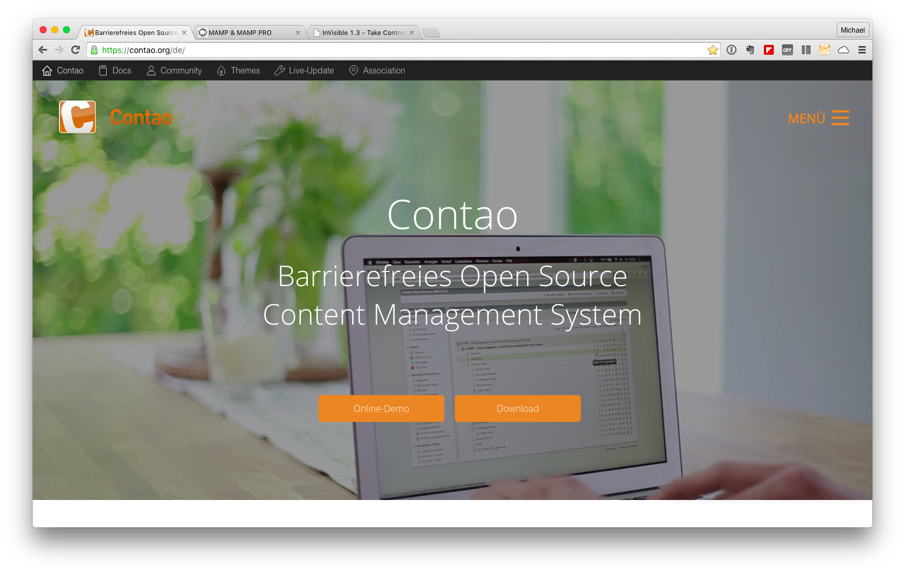

# Das Contao-CMS
Das seit neun Jahren aktive Contao-CMS, ist mittlerweile eine feste Größe unter den Open-Source Content-Management-Systemen. Seine einfache und intuitive Bedienung findet immer mehr Zuspruch. Für mich ist es das bevorzugte CMS, bei der Umsetzung meiner Projekte. Bisher gab es noch keinen Fall, in dem eine Umsetzung behindert oder gar unmöglich gewesen wäre.

Das Contao-CMS ist barrierefrei, gestaltungsneutral und es können alle erdenklichen grafischen Umsetzungen mit diesem System realisiert werden. Die Installation, unter MAMP (XXAMP) oder auf einem gängigen Webspace, ist problemlos. Das CMS kann kostenfrei unter http://www.contao.de/ heruntergeladen werden.

## Die Installation
Nach dem man die aktuelle ZIP-Datei heruntergeladen hat, kann man Contao unter einem Apache Webserver installieren. Ich möchte hier alleinig die Installation der Contao-Version 3.5.x unter der kostenfreien Version von MAMP (https://www.mamp.info/) vorstellen, da der <.CONMUNICATOR> so ohne kostenfrei getestet werden kann.

Alle Schritte können auch auf Ihrem eigenen Webspace erfolgen. Die entsprechenden Zugangsdaten für Ihren FTP-Zugang und die notwendige MySQL-Datenbank entnehmen Sie den Informationen Ihres Providers. Für den Betrieb des <.CONMUNICATOR>, auf einer Top-Level-Domain, wird eine entsprechende kostenpflichtige Lizenz benötigt.

Sofern Sie MAMP auf Ihrem Computer installiert haben, finden Sie den Ordner **/htdocs** unter dem Programmverzeichnis von MAMP. Kopieren Sie die ZIP-Datei in das Verzeichnis und entpacken Sie das Archiv. Nach dem Entpacken finden Sie folgende Struktur vor.

Wenn Sie unter MacOS X arbeiten werden Ihnen wichtige Dateien unterschlagen. Es existiert eine Datei mit dem Namen **.htaccess.default**. Der Dateiname beginnt mit einem Punkt und unter MacOS X werden Dateien, die mit einem Punkt beginnen, nicht angezeigt.

Hierzu benötigen Sie ein Tool, welches es Ihnen ermöglicht diese Dateien sichtbar zu machen. Unter http://www.northernspysoftware.com/software/invisible finden Sie ein solches. Das Tool kann kostenfrei heruntergeladen werden.

Aktivieren Sie den Menupunkt "Show invisible files" und die genannte Datei wird sichtbar.

Selektieren Sie nun alle Dateien im entsprechenden Ordner und schieben Sie diese direkt unter /htdocs. Der Ordner /contao-3.5.x wird nicht mehr benötigt und kann danach gelöscht werden.

## Anlegen einer Datenbank
Um Contao betreiben zu können benötigen Sie zusätzlich eine MySQL-Datenbank. Diese lässt sich über phpMyAdmin einrichten. Zu finden ist phpMyAdmin unter den Tools von MAMP.

Nach dem Start von phpMyAdmin kann die Datenbank angelegt werden. Vergeben Sie **( 1. )** einen sinnvollen Namen und **( 2. )** die richtige Zeichensatzkodierung. Danach klicken Sie auf "Anlegen".

Die Arbeit in phpMyAdmin ist beendet und Sie können das entsprechende Fenster/Tab schließen.

## Konfiguration des CMS
Nach dem nun die Datenbank bereitgestellt und das CMS korrekt aufgespielt ist, kommt die finale Konfiguration des CMS über die URL http://localhost/contao/install.php. Beim Erstmaligen Aufruf müssen Sie die GNU-Public License einmalig bestätigen. Im Nachgang vergeben Sie ein Passwort für den Installationszugang und merken sich dieses für zukünftige Zugriffe.

Damit Contao seine Datenbankverbindung konfigurieren kann, geben Sie die gültigen Zugangsdaten unter MAMP ein. Nutzen Sie zusätzlich den Datenbanknamen, den Sie zuvor unter phpMyAdmin angegeben haben.

| Elemente: | Werte: |
| -- | -- |
| Host | localhost |
| Port | 8889 |
| User | root |
| Kennwort | root |

Contao erkennt selbstständig, dass die von Ihnen angelegte Datenbank noch keine Struktur oder Inhalt besitzt. Die benötigten Tabellen und die darin enthaltenen Datenstruktur legt Contao entsprechend an.

Jetzt fehlt nur noch ein Administrator Account und Sie haben die Konfiguration erfolgreich beendet. Das Contao-CMS ist nun einsatzbereit.

