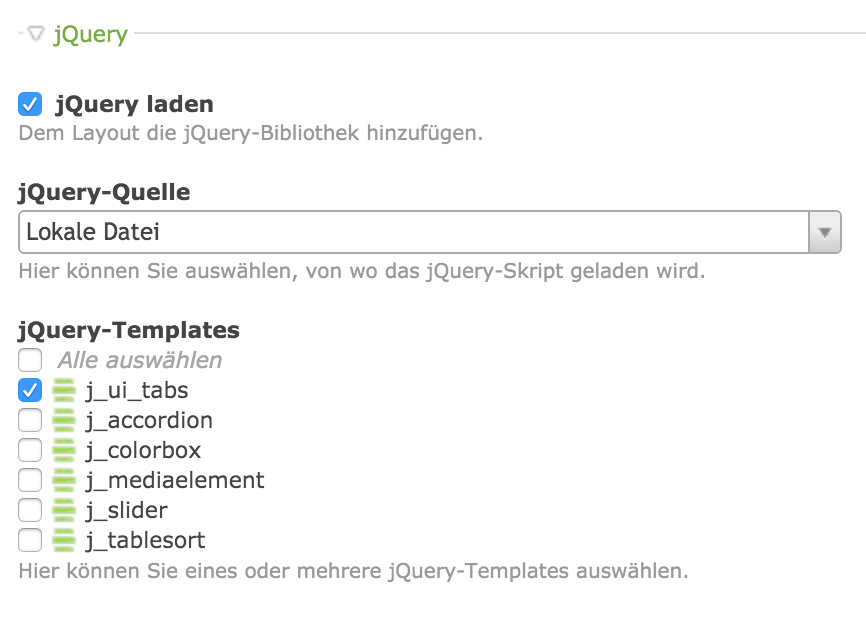

# jQuery
Einige Erweiterungen des Contao-CMS beruhen auf jQuery (http://www.jquery.com). Um eine Nutzung der von Contao genutzten jQuery-Version zu ermöglichen, sind zwei Schritte notwendig.

## 1. Das Seitenlayout anpassen
Im Seitenlayout muss jQuery aktiviert werden. Bei Bedarf können dann zusätzliche jQuery-Templates ausgewählt werden.



## 2. Template anpassen
In der Datei "[fe_conmunicator.html5](feconmunicator_html5.md)" unter dem Ordner "/templates", muss die Konfiguration "useContaoJQuery" aut "true" gesetzt werden. <.CONMUNICATOR> tauscht so jQuery automatisch aus.

```php
<?php
//==================================================================================
// fe_conmunicator.html5
//----------------------------------------------------------------------------------
// Bringing two worlds together …
//==================================================================================
session_start();

$muse = array(
	"dir" 				=> "files/muse/",
	"conf"				=> array(
							"templateFile" => "",
							"stripComments" => true,
							"minimizeCode"	=> false,
							"useContaoJQuery" => true,
							"replaceJQuery"	=> false,
						),
);

include("conmunicator/core/conmunicator.php");
?>
```