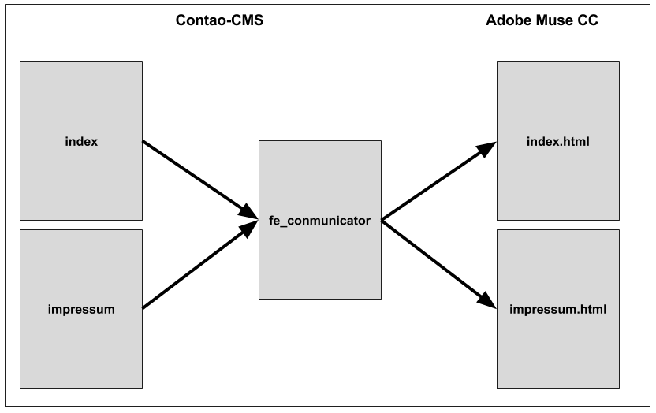
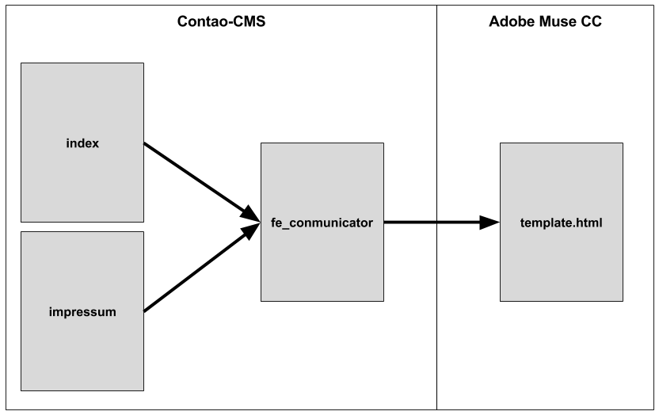

# Templating

Nicht in jedem Fall ist das Mapping der Seiten über den Contao-Seiten-Alias sinnvoll. Vorallem bei komplexeren Websites wird dieses Vorgehen kompliziert, denn für jede Contao-Seite benötigt man eine passende Adobe Muse CC Seite.

In diesem Fall ist es sinnvoll eine andere Strategie zu nutzen. In Adobe Muse CC baut man nur noch die Seiten auf, die man für die Visualisierung der Website benötigt. Über die Angabe "**templateFile**" kann in der Datei **fe\_conmunicator.html5** ein direkter Dateinamen angegeben werden.

Dies füht dazu, dass das normale Alias-Mapping außer Kraft gesetzt wird. Nutzt eine Contao-Seitenlayout dieses Template, so werden alle Contao-Seiten unter Nuzung der angegebenen Adobe Muse CC Datei ausgegeben.

Dupliziert man **fe\_conmunicator.html5** und ändert den Dateinahmen in **fe\_****\[****etwasAnderes\]****.html5**, so kann die Datei in weiteren Contao-Seitenlayouts als Template verwendet werden.

