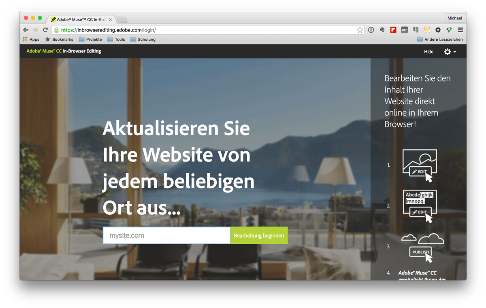

# Use-Cases
Der Conmunicator lässt sich in unterschiedlichen Anwendungsfällen unterschiedlich einsetzen. Nachstehend finden Sie die gängigsten beschrieben.

## Erstellen einer kompletten Website in Adobe-MUSE
Durch den Einsatz von Adobe-MUSE ist es relativ einfach eine interessant gestaltete responsive Website zu erstellen. Oft wird aber von Kundenseite gewünscht Inhalte selbst pflegen zu können.

Hierzu hat Adobe in Adobe-MUSE eine eigene Lösung parat. Diese nennt sich "Adobe-Muse CC In-Browser Editing" und ist unter https://inbrowserediting.adobe.com erreichbar.

Das Problem bei dieser Lösung, es lassen sich nur bestimmte Elemente für die Dynamisierung verwenden. Somit ist eine teilweise oder vollumfängliche Dynamisierung, wie mit dem Conmunicator und dem Contao-CMS, nicht gegeben.

## Adobe Muse CC als Template-Generator nutzen
Unter Nutzung des <.CONMUNICATOR> ist es möglich Adobe-MUSE als Template-Generator zu nutzen. Durch die Erstellung von einzelnen Seiten in Adobe-MUSE können diese als Templates für verschiedene Contao-Seiten dienen.

Hierzu duplizieren Sie die Datei "fe_conmunicator.php" und benennen diese sinnvoll um. Danach editieren Sie die Datei und tragen unter "[templateFile](fe_conmunicator.md)" den entsprechenden Dateinamen der Adobe-MUSE Seite ein.

Nun brauchen Sie nur noch das entsprechende Seitenlayout unter Contao anzupassen. Wählen Sie das neue Template im Seitenlayout aus und schon haben Sie eine Adobe-MUSE Seite als Template verknüpft.
