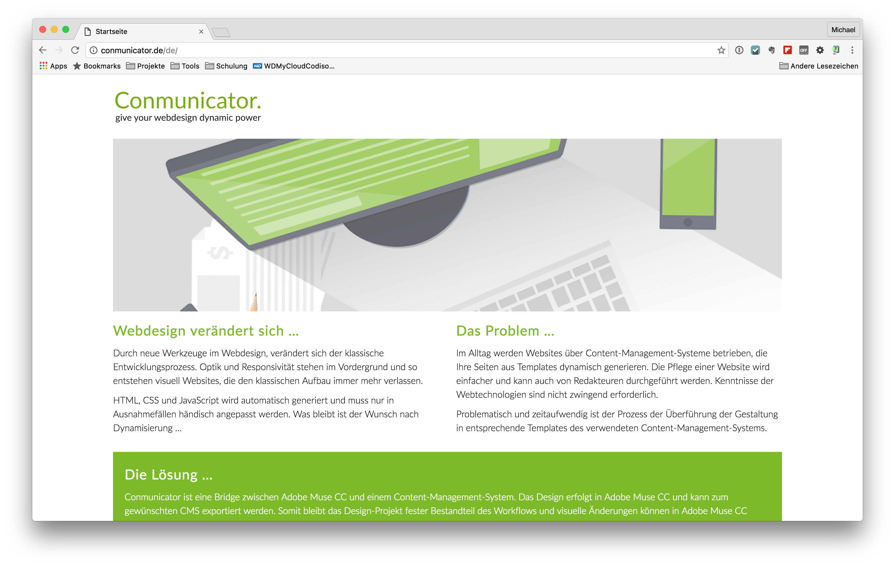
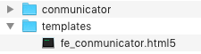

# Install Conmunicator
To install Conmunicator, you must download the latest version from http://www.conmunicator.de.

After downloading you will find the .zip archive in your download folder. Unpack the archive, and the shown file structure is present in the folder.

## Contao 3.x

Copy the folder named "conmunicator" to the root directory of your Contao installation. Copy the files from "templates" to the Contao directory "templates".

The Conmunicator is now ready for local use. For an operation on a top-level domain, you need an appropriate [license](lizenzen.md).

## Contao 4.x

Copy the folder named "conmunicator" to the folder "web" of your Contao installation. Copy the files from "templates" to the Contao directory "templates".

The Conmunicator is now ready for local use. For an operation on a top-level domain, you need an appropriate [license](lizenzen.md).
