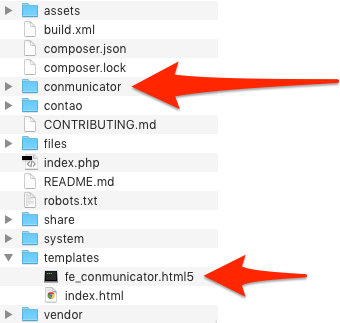

# Install Conmunicator
To install Cinmunicator, you must download the latest version from http://www.conmunicator.de.

After downloading you will find the .zip archive in your download folder. Unpack the archive, and the shown file structure is present in the folder.

Copy the folder named "communicator" to the root directory of your Contao installation. Copy the file "fe_conmunicator.html5" to the subdirectory **/templates**.

The <.COMMUNICATOR> is now ready for local use. For an operation on a top-level domain, you need an appropriate [license](lizenzen.md).