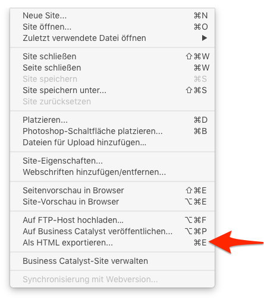
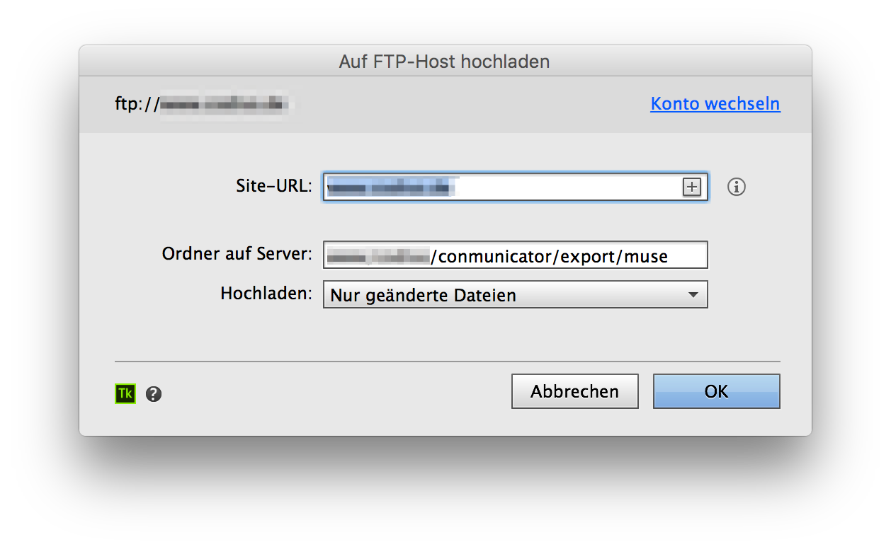
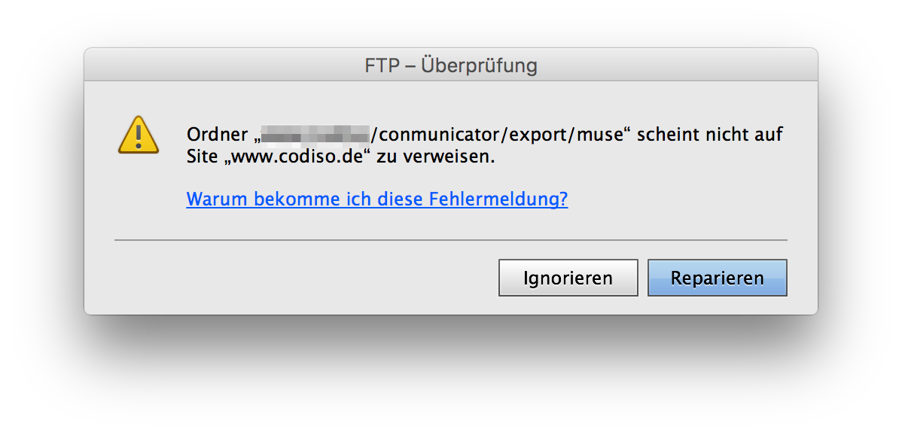

# Export the Adobe-MUSE Project
To perform an export to your Contao installation, you can follow two different ways. The first leads through the HTML export, the second is feasible through an FTP export.

If you are looking into the directory '/communicator/export' you will find a folder named 'muse'. This folder is the predefined folder for the template 'fe_conmunicator.html5'. If you want to use a different name or path, so you can adjust it in the template itself.

```php
<?php
//==================================================================================
// fe_conmunicator.html5
//----------------------------------------------------------------------------------
// Bringing two worlds together …
//==================================================================================
session_start();

$muse = array(
	"dir"   => "conmunicator/export/muse/",
    [...]
);

include("conmunicator/core/conmunicator.php");
?>
```

## HTML-Export
The HTML export can be activated from the "File" menu. After selecting a folder for your export, the export process can be started. Adobe-MUSE generates all the necessary files and folders.



To copy the export to the <.COMMUNICATOR> export folder, an FTP transfer is necessary. To do this, you can choose your favorite FTP program.

If you use <.COMMUNICATOR> locally with XAMPP or MAMP, the HTML export is the easiest way to save the project in the appropriate folder of the local Contao installation.

## FTP-Export
It is more elegant to use the build in FTP export from Adobe-MUSE. In this case, Adobe MUSE takes the role of an FTP-Client. If you make further changes to the design project you can simply renew your export and only the changed data will be transfered. This speeds up the export process considerably.


Enter your FTP account data from your provider and confirm the entries. After that the following dialog appears.



Enter a valid domain and the path to the export folder under "/ conmunicator/export/muse" of your Contao installation. The setting "Only changed data" is correct and can be accepted. Confirm the entries and you are usually faced with the following message.



Adobe-MUSE detects that the specified path does not point to the root of your domain. Click "ignore" or press the escape key and start the upload. After a successful upload the selected domain is called in the browser. The design changes will be shown directly.