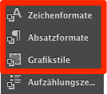

# Dynamize the Adiobe Muse CC Project

Conmunicator uses the styles from Adiobe Muse CC to combine dynamic content from Contao with the visual elements of Adiobe Muse CC. This is an easy operation and requires no further programming skills.

This procedure can also be performed by graphic designers, who have no knowledge of HTML, CSS or JavaScript. An extremely close cooperation between graphics and programming can talke place. Both parties have a well-defined interface.

Elements from Adiobe Muse CC, which use the special styles are automatically replaced with content from the Contao-CMS.

## Styles

For simple integration of Contao content, the following styles are provided:

| Style: | Importance: |
| -- | -- |
| cmu_main | Content of the Contao main section.|
| cmu_header | Content of the Contao head section.|
| cmu_footer | Content of the Contao footer section.|
| cmu_left | Content of the Contao left section.|
| cmu_right | Content of the Contao right section. |
| cmu_section_NAME | Content of an Contao custom section.|
| cmu_template_NAME | Content of own [code templates](templating.md) using the given name. The appropriate files are stored under the path **/conmunicator/templates/[DEVICE]**. If the named [template](templating.md) does not exist, it is automatically created with the content of the used Adiobe Muse CC element.|
| cmu_article_LANG_ID | Content of an Contao article for a special language using the article ID.|
| cmu_content_LANG_ID | Content of an Contao content element for a special language using the element ID.|
| cmu_module_LANG_ID | Content of an Contao module for a special language using the module ID.|

Replace the following placeholders with the appropriate values:

| Placeholder: | Substitution: |
| -- | -- |
| DEVICE | You can use the values "desktop","tablet" or "phone".|
| NAME | Replace it with the desired designator.|
| LANG | Use the language shortcuts (de,en,it,etc.)|
| ID | The ID of the used Contao element.|

The styles can be used in the Adiobe Muse CC styles panel. Adiobe Muse CC gives you the possebility to define font-, paragraph- and graphic-styles. Normaly the graphic-style panel is the right place for the use of <.CONMUNICATOR> style definitions.

Styles can be used with more than on definition. For more Information see the [multilanguage chapter](cmu_multilanguage.md).

## Placeholders

Placeholders can be used in text. They are replaced by the contents described below. The syntax ist the same as if you use the [Contao-InsertTags](https://docs.contao.org/books/manual/3.5/en/04-managing-content/insert-tags.html). Insert tags can also be used in Adiobe Muse CC.

| Platzhalter: | Bedeutung: |
| -- | -- |
| {{cmu_main}} | Replaced by the content of the Contao main column.|
| {{cmu_header}} | Replaced by the content of the Contao head.|
| {{cmu_footer}} | Replaced by the content of the Contao footer.|
| {{cmu_left}} | Replaced by the content of the Contao left column.|
| {{cmu_right}} | Replaced by the content of the Contao right column.|
| {{cmu_section_NAME}} | Replaced by the content of an Contao custom section.|
| {{cmu_template_NAME}} | Content of own [code templates](templating.md) using the given name. The appropriate files are stored under the path **/conmunicator/templates/[DEVICE]**.|
| {{cmu_article_LANG_ID}} | Replaced by the contents of a specific Contao article for a particular language using the item ID.|
| {{cmu_content_LANG_ID}} | Replaced by the contents of a specific Contao content element for a particular language using the element ID.|
| {{cmu_module_LANG_ID}} | Replaced by the contents of a specific Contao module for a particular language using the module ID.|
| {{cmu_version}} | Replaced by the actual version of Conmunicator.|
| {{cmu_muversion}} | Replaced by the actual Adiobe Muse CC version.|
| {{cmu_phpversion}} | Replaced by the actual PHP version.|
| {{cmu_language}} | Replaced by the actual language. If necessary it can be used inside of links.|

Replace the following placeholders with the appropriate values:

| Placeholder: | Substitution: |
| -- | -- |
| NAME | Replace it with the desired designator.|
| LANG | Use the language shortcuts (de,en,it,etc.)|
| ID | The ID of the used Contao element.|

