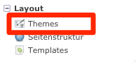
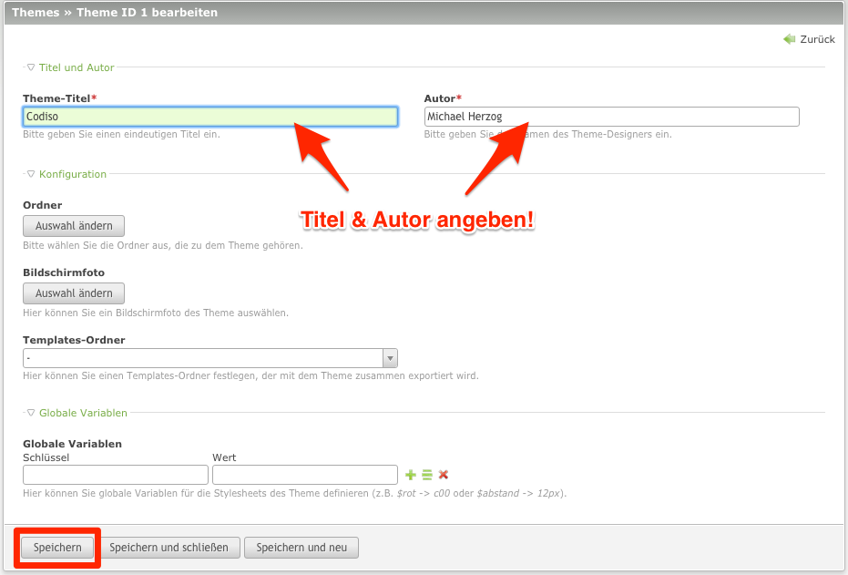
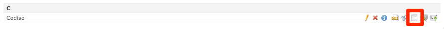
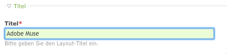
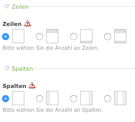
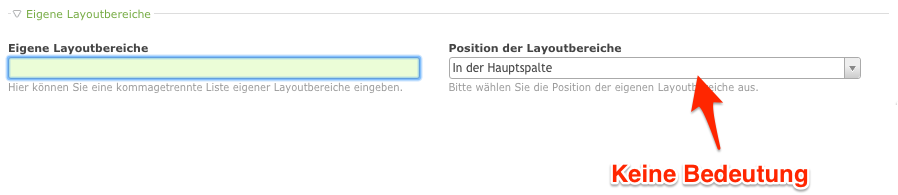
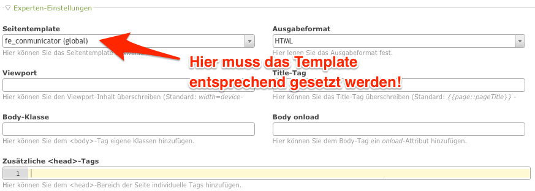

# Building Conmunicator-Themes
A Theme takes the task to bind a design to site. In a theme there are page layouts that define the content areas. In such areas then corresponding content can be viewed. To use the theme with <.CONMUNICATOR>, appropriate settings must be made.

## Creating Themes
In a new Contao installation there are no Themes included. At least one must be created by you. Change the workspace to the Themes section.

Use the "new theme" button to create a completly new theme.

After doing so, you see an dialog in which you can specify all the necessary settings for this theme. Enter a title and the corresponding author. Afterwards you save the settings.

## Define a page layout
To define the appearance of a page, you have to create a page layout. Click on the corresponding icon for page layouts. An empty list will be presented.

In the list, select the "new layout" button. Enter all informations about the layout in the shown dialog.

### Titel
Assign a meaningful identifier for your layout. This entry is a purely organizational process.

### Rows
Within Contao the classic five-column grid can be preconfigured. In connection with Adobe-MUSE you can use this columns, although if those columns not be arranged according to the classical pattern. Each column selected can be used to show corresponding content.

### Custom layout sections
In this area you can define own layout regions that play a role in your page. These are entered by seperating the names by comma. Each of them can be used to show content on your page. If you use a corresponding style in Adobe Muse, you can determine where these contents will be shown in your Adobe MUSE page.

A positioning of the layout areas in Contao have no meaning, because their position is defined in Adobe MUSE.

### Webfonts
The integration of Web fonts is an easy task. Adobe-MUSE itself regulates this via the Creative Cloud. If you want to integrate a font with Contao, feel free to do so.

### Stylesheets
Most of the integrated CSS frameworks are not required in conjunction with Adobe-MUSE. Adobe-MUSE uses jQuery and includes all JavaScript files needed.

You can use internal and external style sheets. In some cases it makes sense to integrate your own CSS files to redefine styles defined by Adobe-MUSE. My favorite is the integration of an own external SCSS file. So you can use the flexibility of SASS (http://sass-lang.com/).

The loading sequence of stylesheets also plays a minor role here. All stylesheets defined in the page layout will be loading according to Adobe-MUSE stylesheets and so they are more dominant.

### Responsive images
It is possible to use this feature!

### RSS/Atom-Feeds
If you use messages or events inside Contao, it is possible to use RSS or ATOM feeds. Corresponding files are created by Contao and a link to the files is integrated automaticly.

### Frontend-Modules
The front-end modules allow the assignment of content to specific layout areas. You can use standard or custom layout regions. To define the areas where the content should be dísplayed use corresponding styles in Adobe-MUSE.

### Expert-Settings
In the expert settings, it is important that the template of <.CONMUNICATOR> is selected. This is the guarantee that a page in Contao gets matched with a corresponding page from Adobe-MUSE. The resulting HTML code is now based on the export of Adobe-MUSE. All other information can be filled optionally.

### jQuery / MooTools
A selection of frameworks is not mandatory. Adobe MUSE works with jQuery and bind this automatically. It is possible to replace this version with the version of Contao. You can get further information [here](jquery.md).

Using Mootools in conjunction with jQuery is not recommended because it can lead to side effects between the two function libraries.

### Static layout
The design is specified in Adobe-MUSE, no adjustment has to take place here.