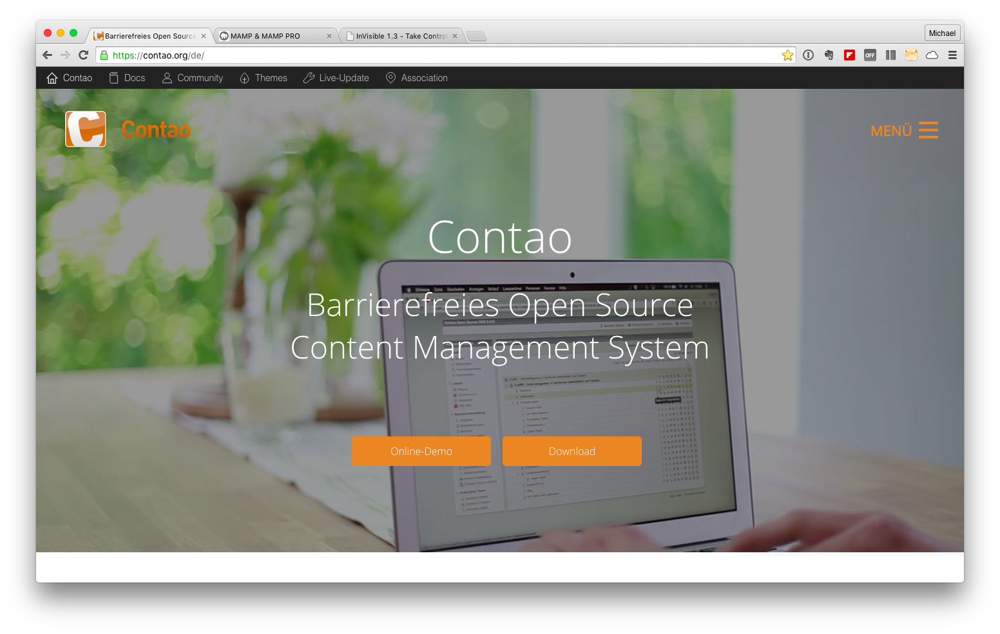

# The Contao-CMS
The Contao-CMS is devloped since 10 years and now it is a permanent fixture among the open source content management systems. The usage is simple and intuitive and it is receiving increasing support from the community. For me, it is the preferred CMS for the implementation of my projects. So far there has been no case in which the system hinders me to finalize my implementations.

The Contao-CMS is accessible, neutral to your designs. The installation , with MAMP ( XXAMP ) or on a common web space is smoothly. The CMS can be downloaded free of charge under http://www.contao.de/ .

## The Installation
The installation of Contao is described in the provided manuals. You  will find all information here:

[Contao 3.5.x LTS](https://docs.contao.org/books/manual/3.5/en/01-installation/contao-installieren.html)

[Contao 4.x](https://docs.contao.org/books/manual/4.2/en/01-installation/contao-installieren.html)