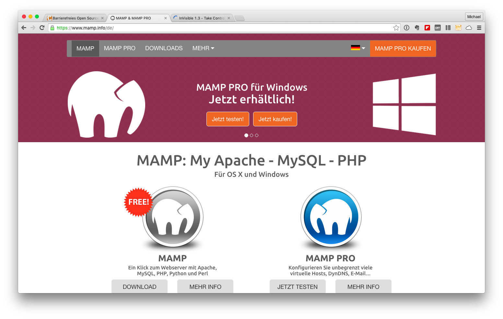
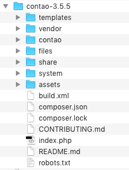
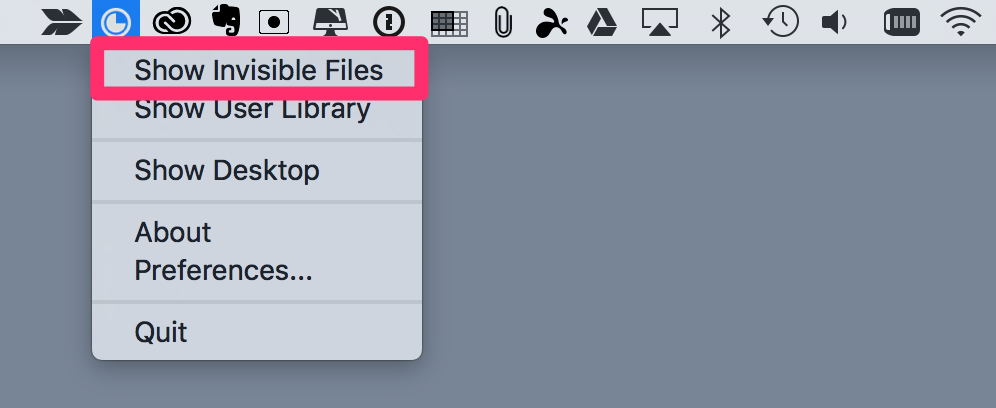
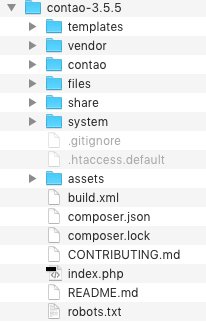
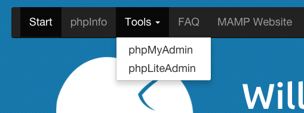
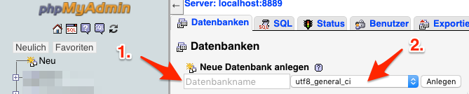

# The Contao-CMS
The Contao-CMS is devloped since 10 years and now it is a permanent fixture among the open source content management systems. The usage is simple and intuitive and it is receiving increasing support from the community. For me, it is the preferred CMS for the implementation of my projects. So far there has been no case in which the system hinders me to finalize my implementations.

The Contao-CMS is accessible, neutral to your designs. The installation , with MAMP ( XXAMP ) or on a common web space is smoothly. The CMS can be downloaded free of charge under http://www.contao.de/ .

## The Installation
After you have downloaded the latest zip file, you can install Contao under an Apache Web server. I only show the installation of Contao version 3.5.x and the free version of MAMP ( https://www.mamp.info/ ). In this combination <.CONMUNICATOR> can be tested without any cost.

All steps can also be done on your own webspace. The relevant access data for your FTP account and the necessary MySQL database, refer to the information from your provider. To operate <.CONMUNICATOR>, on a top-level domain, a corresponding valid license is required.

Unless you have MAMP installed, locate the folder **/htdocs** under the program folder MAMP . Copy the zip file to the directory and unpack the archive. After unpacking you will find the following file structure.

If you are working under MacOS X you embezzled important files. There is a file named **.htaccess.default**. The file name starts with a dot, and MacOS X does not show those files.

You need a tool which allows you to make these files visible. Under http://www.northernspysoftware.com/software/invisible you can find such a tool. You can download it free of charge.

Select the menu item "Show invisible files" and the hidden files are visible.

Now select all the files in the appropriate folder and move it directly under /htdocs . The folder /contao-3.5.x is no longer needed and can be deleted afterwards.

## Create a database
To use Contao you also need a MySQL database. the database can be set up via phpMyAdmin. You find phpMyAdmin under the tools of MAMP.

After starting phpMyAdmin a database can be created. Assign **( 1 )** a meaningful name and **( 2 )** the correct character encoding. Then click on "Create".

The work with phpMyAdmin is finished and you can close the window/tab.

## Configuration of the CMS
After providing the database the final configuration of the CMS, via the URL http://localhost/contao/install.php, can take place. The first time you have to accept the GNU Public License. Afterward choose a password for the installation. Remember the password for future access.

For configurating the database connection, enter the valid credentials under MAMP. Use the database name you specified earlier under phpMyAdmin.

| Elements: | Values: |
| -- | -- |
| Host | localhost |
| Port | 8889 |
| User | root |
| Password | root |

Contao automatically detects that your created database has no structure or content in it. The necessary tables are automaticly build by Contao.

Now you just need to create an administration account and after that you have completed the configuration successfully . The Contao-CMS is now up and running.

